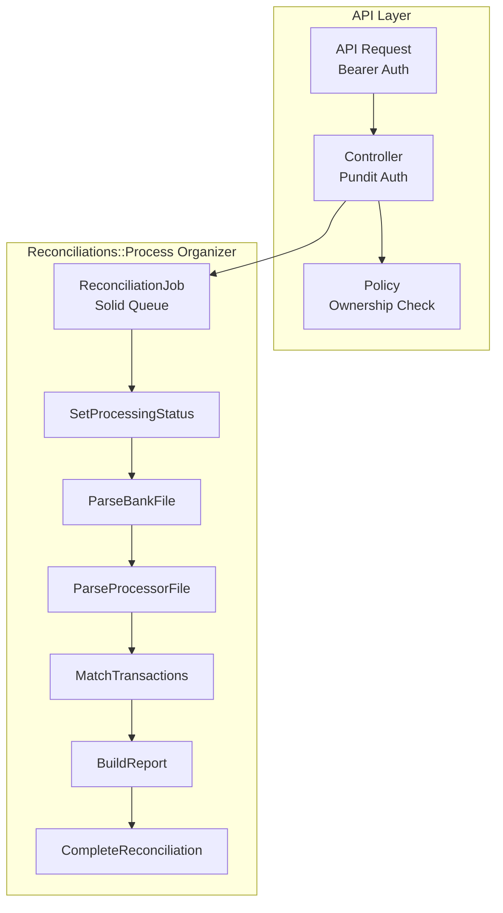

<p align="center">
  
</p>

<h1 align="center">Auditron</h1>

<p align="center">
  <strong>Payment Reconciliation API</strong><br>
  Automated transaction matching and discrepancy detection
</p>

<p align="center">
  
  
  
  
  
</p>

---

## What is Auditron?

Auditron is a Rails API that reconciles payment transactions between **bank statements** (CSV) and **payment processor records** (JSON). It identifies:

- ✅ **Matched transactions** — Same ID and amount in both sources
- ⚠️ **Discrepancies** — Same ID but different amounts
- 🏦 **Bank-only** — Transactions only in bank file
- 💳 **Processor-only** — Transactions only in processor file

### Current Features

- RESTful API with Bearer token authentication
- Background job processing with Solid Queue
- File upload support via Active Storage
- Pagination, rate limiting, CORS configured
- 98%+ test coverage with RSpec

### Future Vision

- 🤖 **ML-powered fraud detection** — Pattern recognition for suspicious transactions
- 📊 **Dashboard UI** — Real-time monitoring and alerts
- 🔌 **Webhook integrations** — Stripe, PayPal, bank APIs
- 📈 **Historical analytics** — Trend analysis and reporting

---

## Architecture



### Tech Stack

| Component | Technology |
|-----------|------------|
| Framework | Rails 8.1 (API-only) |
| Database | SQLite with UUID primary keys |
| Background Jobs | Solid Queue |
| File Storage | Active Storage |
| Authentication | Bearer token (SHA256 hashed) |
| Authorization | Pundit policies |
| Pagination | Pagy |
| Rate Limiting | Rack::Attack |

---

## Database Schema

```
users
├── id (uuid)
├── email (unique)
└── password_digest

api_keys
├── id (uuid)
├── user_id → users
├── token_digest (unique, SHA256)
├── name
├── expires_at
└── last_used_at

reconciliations
├── id (uuid)
├── user_id → users
├── status (pending → processing → completed/failed)
├── matched_count, bank_only_count, processor_only_count, discrepancy_count
├── report (JSON)
├── error_message
└── processed_at
```

---

## Quick Start

### System Requirements

- Ruby 3.4.7
- Bundler (`gem install bundler`)

> **Note:** Rails 8.1 and all dependencies are installed automatically via Bundler.

### Setup

```bash
# Clone and install
git clone <repo-url> && cd auditron
bin/setup

# Create demo user with API key
bin/rails db:seed
# ⚠️ Save the API token printed - you'll need it!

# Start server with job processing
bin/dev
```

---

## API Testing with Postman

Import the ready-to-use collection: **[Auditron_API.postman_collection.json](postman/Auditron_API.postman_collection.json)**

1. Set the `api_token` variable to your token from `bin/rails db:seed`
2. All requests are pre-configured with Bearer auth

### Manual Setup

Add header to all requests:
```
Authorization: Bearer <your-api-token>
```

### 2. Create Reconciliation

```http
POST http://localhost:3000/api/v1/reconciliations
Content-Type: multipart/form-data

reconciliation[bank_file]: <upload bank.csv>
reconciliation[processor_file]: <upload processor.json>
```

### 3. Check Status

```http
GET http://localhost:3000/api/v1/reconciliations/:id
```

### 4. List All

```http
GET http://localhost:3000/api/v1/reconciliations?page=1&limit=25
```

### Sample Files

**bank.csv**
```csv
transaction_id,date,amount,description,status,account_number
TX001,01/04/2023,100.00,Payment One,completed,1234567890
TX002,02/04/2023,250.50,Payment Two,completed,1234567890
```

**processor.json**
```json
{
  "transactions": [
    {"id": "TX001", "timestamp": "2023-04-01T09:15:32Z", "amount_cents": 10000, "merchant": "Payment One", "status": "successful"},
    {"id": "TX002", "timestamp": "2023-04-02T14:22:05Z", "amount_cents": 25050, "merchant": "Payment Two", "status": "successful"}
  ]
}
```

---

## Quality Checks

```bash
# Run all checks
bin/ci

# Individual checks
bundle exec rspec                    # Tests (98%+ coverage)
bundle exec rubocop                  # Style (0 offenses)
bundle exec reek                     # Code smells (0 warnings)
bundle exec brakeman -q              # Security scan
bundle exec bundler-audit check      # Dependency vulnerabilities
```

---

## License

MIT